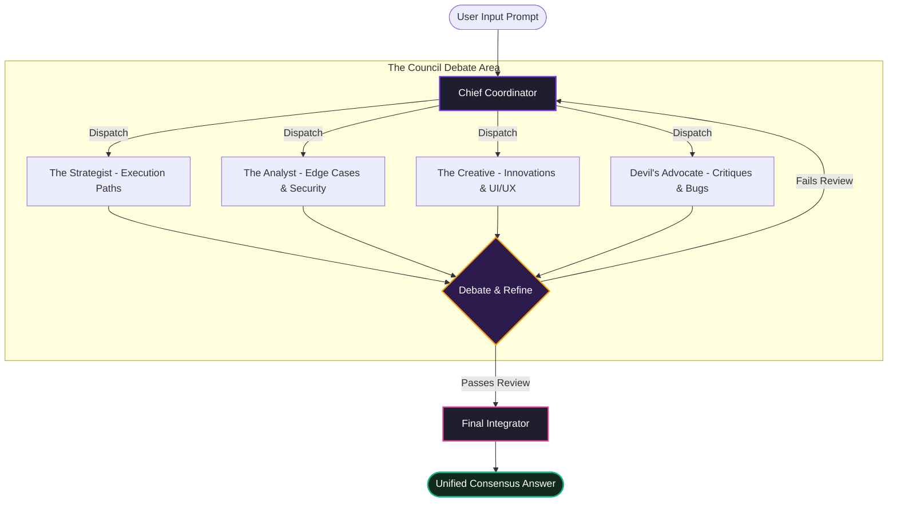

# 🌌 PLURAL — Unity With AI

<p align="center">
  
  
  
</p>

<p align="center">
  
</p>

<p align="center">
  <b>"Clarity Synthesized from Chaos. Unity Achieved through Debate."</b><br />
  <sub>PLURAL is an ultra-futuristic, multi-perspective AI platform that coordinates specialized agent personas to debate, challenge, and refine inputs into a single-source consensus.</sub>
</p>

---

## ⚡ The Architecture: Multi-Agent Consensus Loop

Rather than accepting a single LLM output, PLURAL splits execution into a **cognitive debate loop**. Personas inspect, criticize, and rebuild prompts recursively before presenting the synthesized truth.



---

## 🚀 Core Features

### 🏛️ The Council Room
Four specialized AI agents collaborate dynamically in the background:
*   🔮 **The Strategist** (`#7C3AED`) — Formulates high-level architectures, determines package dependencies, and lays out execution trees.
*   🛡️ **The Analyst** (`#06B6D4`) — Dissects raw code, monitors memory footprint, and exposes hidden structural security threats.
*   🌸 **The Creative** (`#EC4899`) — Infuses user experience highlights, modern styling schemes, and designs visual interfaces.
*   🔥 **The Devil's Advocate** (`#F59E0B`) — Acts as QA reviewer, pointing out code smells, dead code blocks, and logical errors.

### 🎭 Digital Twins & Clones
*   🤖 **AI Clone** — Creates a custom linguistic style profile based on your writing samples. Your clone writes, replies, and reasons exactly like you.
*   🛸 **AI Twin** — An autonomous assistant that handles background tasks, monitors directory paths, and auto-completes repetitive command structures.

### 🛡️ Knowledge Vaults (Private RAG)
*   **Semantic Storage** — Crawl documentation links, index write-ups, or upload private PDFs.
*   **Vector Retrieval** — Context-matching injects relevant facts directly into your active workspace models.

---

## 🎨 Implemented Visual Aesthetics

The PLURAL interface is designed with a premium, cybernetic sci-fi aesthetic:
*   **Interactive CyberNetwork Canvas** — Dynamic HTML5 backdrop drawing active connection nodes following cursor coordinates.
*   **Parallax Glow Orbs** — Ambient glassmorphism backgrounds reflecting layout movements.
*   **Mouse-Wheel Image Sequence** — Sticky scroll sequencer giving a premium intro feeling.
*   **3D Robotic Companion** — Interactive Spline 3D robot model responding to mouse coordinates.

---

## 🛠️ Cybernetic Tech Stack

| Component | Tech | Advantage |
| :--- | :--- | :--- |
| **Interface** | **Vanilla HTML5 & CSS3** | Custom-crafted styled panels, fluid animations, and absolute layout control |
| **3D Assets** | **Spline 3D Loader** | WebGL-rendered 3D workspace companion model |
| **Cloud Base** | **Supabase DB & Auth** | Real-time session syncing, workspace config storage, and API key vaulting |
| **Highlighting** | **Highlight.js** | Tokyo Night styled dark theme markdown visualization |
| **Processing** | **PDFJS & JSZip** | Client-side memory loading, binary parsing, and workspace exports |

---

## ⚡ Setup & Verification

```bash
# 1. Clone the repository
git clone https://github.com/IAMONCRYPTO/PLURAL.git

# 2. Enter the workspace
cd PLURAL

# 3. Install core dependencies
npm install

# 4. Boot the server console
node server.js
```

Once running, navigate to `http://localhost:3000` to launch the **PLURAL Console**.

---

<p align="center">
  <sub>Developed with 💜 and absolute precision for programmers who refuse mediocre outputs.</sub>
</p>
