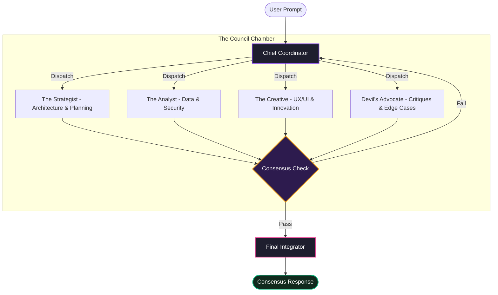

# PLURAL — Unity With AI

<p align="center">
  <a href="https://plural-unity.netlify.app/">
    
  </a>
</p>

<p align="center">
  <a href="https://plural-unity.netlify.app/">
    
  </a>
  
  
</p>

---

## Overview

**PLURAL** is a multi-perspective artificial intelligence platform designed to synthesize balanced, single-source consensus from complex user inquiries. Instead of relying on a single LLM output, PLURAL orchestrates a collaborative debate among four specialized AI agents (The Council), challenges their conclusions with a Devil's Advocate persona, and delivers a unified, high-integrity synthesis.

*   **Live Application:** [https://plural-unity.netlify.app/](https://plural-unity.netlify.app/)
*   **Documentation:** [REACT_SETUP.md](file:///d:/PLURAL/REACT_SETUP.md)

---

## System Architecture

PLURAL utilizes a layered multi-agent loop to refine prompt execution:



---

## Key Features

### 🏛️ The Council (Multi-Agent Synthesis)
Four expert personas evaluate each input through distinct cognitive lenses:
*   **The Strategist** — Formulates high-level roadmaps, dependency structures, and execution plans.
*   **The Analyst** — Evaluates performance overhead, security vulnerabilities, and raw logical validation.
*   **The Creative** — Proposes UI/UX optimizations, creative visual assets, and out-of-the-box user flows.
*   **The Devil's Advocate** — Inspects results for errors, assumptions, edge cases, and structural loopholes.

### 👥 Personalized Digital Twins
*   **AI Clone** — Evaluates style, tone, and formatting patterns from your writing samples to build a personalized linguistic shadow.
*   **AI Twin** — Runs background automations, manages project workspaces, and executes routine tasks based on high-level goals.

### 📁 Knowledge Vault (Semantic RAG)
*   **Vector Storage** — Create private document bases by indexing notes, PDFs, or crawling web documentation.
*   **Dynamic Context Infusion** — Queries local vaults on-the-fly, bringing domain-specific source material directly into current chat contexts.

### 🎨 Visual Engineering
*   **CyberNetwork Canvas** — Interactive vector network drawing cursor-responsive node connections.
*   **Scroll Sequencer** — Frame-by-frame mouse sequence giving a premium entry experience.
*   **Spline 3D Integration** — WebGL-rendered 3D workspace companion.

---

## Tech Stack

*   **Frontend Engine:** Vanilla HTML5, CSS3 Variables, ES6 JavaScript Modules
*   **3D Space:** Spline 3D Viewer & Canvas WebGL
*   **Database & Storage:** Supabase DB (Schema Management & Vector Storage)
*   **File Parsing:** PDF.js Loader & JSZip Workspace Exporter
*   **Syntax Theme:** Tokyo Night Dark via Highlight.js

---

## Installation & Deployment

### Local Development
1.  Clone the repository:
    ```bash
    git clone https://github.com/IAMONCRYPTO/PLURAL.git
    cd PLURAL
    ```
2.  Install dependencies:
    ```bash
    npm install
    ```
3.  Configure your environment:
    Create a `.env` file in the root directory and add your Supabase credentials:
    ```env
    SUPABASE_URL=your_supabase_url
    SUPABASE_ANON_KEY=your_supabase_anon_key
    ```
4.  Start the development server:
    ```bash
    node server.js
    ```
    Open `http://localhost:3000` to launch the console.

### Production Build
To bundle the client assets for production hosting (such as Netlify or Vercel):
```bash
node build.js
```
The optimized bundle will be compiled into the `dist/` directory.

---

<p align="center">
  <sub>Developed for engineers demanding high-integrity outputs. © 2026 PLURAL.</sub>
</p>
