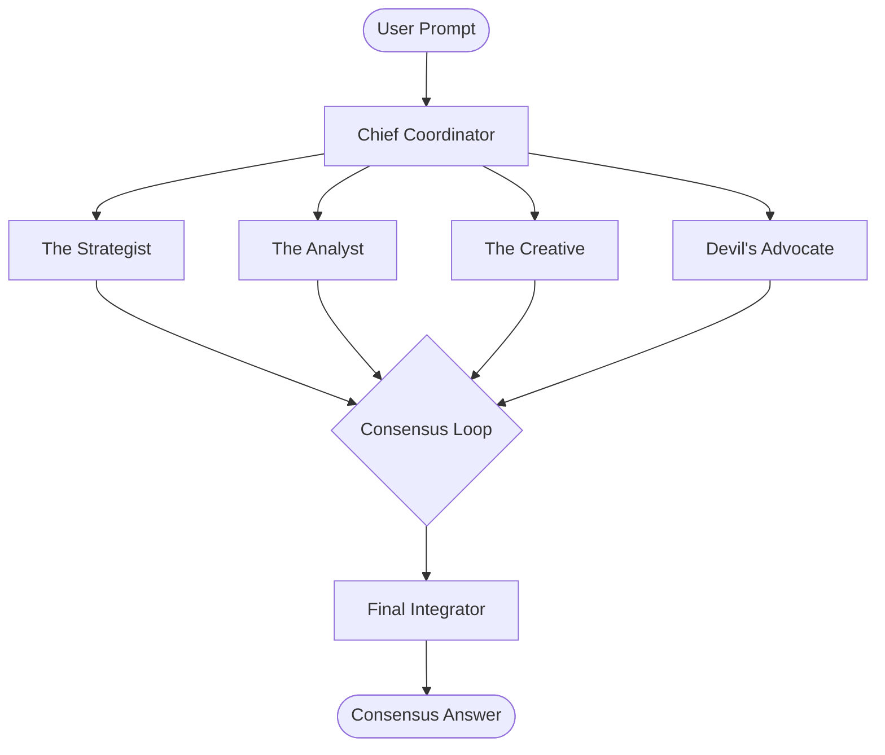

# 🌌 PLURAL — Unity With AI

> **"Clarity Synthesized from Chaos."**  
> An ultra-futuristic, multi-perspective AI platform that brings together specialised agents to debate, collaborate, and deliver unified consensus on complex tasks.

---

<p align="center">
  
</p>

---

## ⚡ The Concept

Instead of relying on a single AI response, **PLURAL** triggers a **multi-agent cognitive debate**. Four custom-profiled AI personas process your inputs, challenge each other, and merge their findings into a single source of truth.



---

## 🚀 Core Modules

### 🏛️ The Council
Four specialized AI minds debate and cross-examine your requests in real-time:
*   **Strategist** (`#7C3AED`) — Maps out high-level vision, dependencies, and execution pathways.
*   **Analyst** (`#06B6D4`) — Breaks down data, security, edge cases, and performance vectors.
*   **Creative** (`#EC4899`) — Drives innovative approaches, user experience improvements, and style.
*   **Devil's Advocate** (`#F59E0B`) — Critically challenges code smells, bugs, and hidden flaws.

### 👥 Digital Shadows
*   **AI Clone** — Interactive style profiling to train your digital twin to write, format, and reason exactly like you do.
*   **AI Twin** — An autonomous companion that acts in the background, intercepts goals, and guides your active workspace sessions.

### 🗄️ Knowledge Vault
*   **RAG Engine** — Upload PDFs, notes, or crawl live URLs to feed your custom private semantic database.
*   **Context Infusion** — Plural queries your vaults dynamically, infusing responses with real domain truth.

---

## 🛠️ Cybernetic Tech Stack

PLURAL is built using cutting-edge client-side technologies for real-time performance and rich interaction:

| Layer | Technology | Purpose |
| :--- | :--- | :--- |
| **3D Rendering** | **Spline 3D** | Interactive 3D robotic companion with scroll-driven parallax |
| **Realtime DB** | **Supabase** | Secure key storage, session state, and persistent workspace configurations |
| **File Processing**| **PDF.js & JSZip** | On-the-fly client-side document parsing and project exporting |
| **Syntax Engine** | **Highlight.js** | Instant markdown and code formatting with Tokyo Night theme |
| **Visual FX** | **CyberNetwork Canvas** | Interactive HTML5 backdrop drawing active connection paths |

---

## ⚡ Quick Start

### 1. Requirements
Ensure you have the latest stable [Node.js](https://nodejs.org/) runtime installed.

### 2. Local Setup
Clone the repository:
```bash
git clone https://github.com/IAMONCRYPTO/PLURAL.git
cd PLURAL
```

Launch the local server:
```bash
npm install
node server.js
```
The console will boot up on `http://localhost:3000`.

---

<p align="center">
  Made with 💜 for developers who want more than just basic chat completions.
</p>
